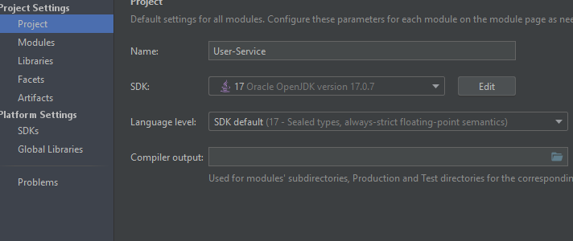
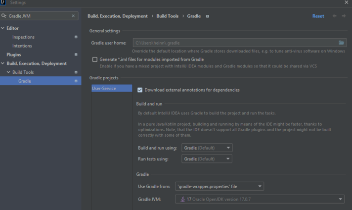

<br />
<div align="center">
<h3 align="center">MESSAGING SERVICE</h3>
  <p align="center">
This is a pragma challenge. In this repository will be all the logic of the messaging service.  </p>
</div>

### Built With

* 
* 
* 

<!-- INTRODUCTION -->
## Introduction
This project consists of 4 services that will make up a food court, which are:
- [User Service](https://github.com/V11Playko/User-Service)
- [Plazoleta Service](https://github.com/V11Playko/Plazoleta-Service)
- [Traceability Service](https://github.com/V11Playko/Traceability-Service)
- [Messaging Service](https://github.com/V11Playko/Messaging-Service)

If you want to find more information about the project,
click [here](docs/information/Information.pdf)

<!-- GETTING STARTED -->
## Getting Started

To get a local copy up and running follow these steps.

### Prerequisites

* JDK 17 [https://jdk.java.net/java-se-ri/17](https://jdk.java.net/java-se-ri/17)
* Gradle [https://gradle.org/install/](https://gradle.org/install/)

### Prevent Possible Mistakes

* Make sure that the project structure uses SDK 17



* Now go to File/Settings and search for Gradle JVM, you have to choose 17 and click apply.
  


### Recommended Tools
* IntelliJ Community [https://www.jetbrains.com/idea/download/](https://www.jetbrains.com/idea/download/)
* Postman [https://www.postman.com/downloads/](https://www.postman.com/downloads/)

### Installation

1. Clone the repository
2. Change directory
   ```sh
   cd Messaging-Service
   ```
<!-- USAGE -->
## Usage

1. Right-click the class MessagingServiceApplication and choose Run
2. Open [http://localhost:8093/swagger-ui/index.html](http://localhost:8093/swagger-ui/index.html) in your web browser
3. To use postman, the entire collection I decided to save [here]().

<!-- ROADMAP -->
## Tests

- Right-click the test folder and choose Run tests with coverage

## Feedback
If you have any comments about the repository, please tell me so I can improve :)

- 📫 How to reach me **heinnervega20@gmail.com**